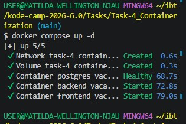
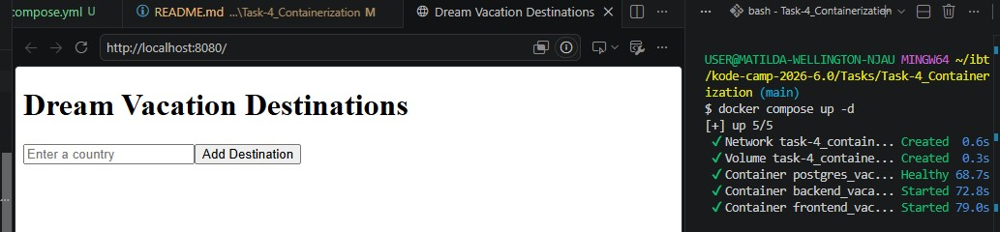

# Dream Vacation Destinations

This application allows users to create a list of countries they'd like to visit, providing basic information about each country. The project is structured to mimic a real-life production environment, employing best practices in software development, deployment, and continuous integration/continuous delivery (CI/CD).

## Setup

### Backend
1. Navigate to the `backend` directory.
2. Run `npm install` to install dependencies.
3. Set up your PostgreSQL database and update the `.env` file with your database URL.
4. Run `npm start` to start the server.

### Frontend
1. Navigate to the `frontend` directory.
2. Run `npm install` to install dependencies.
3. Update the `.env` file with your API URL (e.g., `REACT_APP_API_URL=http://localhost:3001`).
4. Run `npm start` to start the React development server.

## Features
- **Add Countries**: Users can add countries to their dream vacation list.
- **View Country Details**: Displays capital, population, and region information for each country.
- **Remove Countries**: Users can remove countries from their list.
- **Production-Ready Setup**: The project is designed to be scalable and maintainable, following industry-standard practices for deployment and CI/CD.

## Roadmap
- **CI/CD Implementation**: Automate the build, test, and deployment process using industry-standard CI/CD tools.
- **Infrastructure as Code (IaC)**: Implement IaC for automated environment setup and management.
- **Scalability**: Enhance the application to support multiple environments (staging, production) with proper domain names and configurations.
- **Security**: Utilize Kubernetes Secrets and environment variables for secure data management.
- **Microservices**: Modularize the application into microservices to improve maintainability and scalability.

## Technologies Used
- **Frontend**: React
- **Backend**: Node.js with Express
- **Database**: PostgreSQL
- **External API**: REST Countries API
- **CI/CD**: To be implemented with [CI/CD tools, e.g., GitHub Actions, Jenkins, or Azure DevOps]
- **Infrastructure as Code**: To be implemented with tools like Terraform or Helm

## Best Practices
- **Version Control**: All changes are tracked in Git for collaboration and history management.
- **Environment Management**: Separate configurations for different environments (development, staging, production) using environment variables.
- **Security**: Sensitive information is managed using environment variables and Kubernetes Secrets.
- **Documentation**: The project is well-documented to facilitate onboarding and maintenance.

## Docker Setup and Usage

This project uses Docker to containerize the frontend and backend services.

### Prerequisites
* Ensure you have [Docker](https://www.docker.com/) and [Docker Compose](https://docs.docker.com/compose/) installed on your machine.

### Build and Run
1. Navigate to the root directory of the project.
2. Run the following command to build and start the containers:
   ```bash
   docker-compose up -d
   ```
- Once running, you can access the frontend at http://localhost:8080
3. To stop the containers, press Ctrl + C in your terminal, or run:
   ```bash
   docker-compose down
   ```

## Documentation

The screenshots attached below show the application being accessed when the containers are running:

### Running Containers:



### App Accessible:



## CI/CD Pipeline Setup

This project implementats automated **CI/CD pipelines** built with GitHub Actions and Docker Hub. 

To keep builds clean and fast, the logic is decoupled into two separate, multi-stage workflows:
* `.github/workflows/frontend.yml` (Handles the frontend pipeline)
* `.github/workflows/backend.yml` (Handles the backend pipeline)

---

### Multi-Stage Workflow Design

Each workflow isolates its **Continuous Integration (CI)** and **Continuous Delivery (CD)** logic using independent jobs. The delivery stage is strictly gated by the testing stage using the `needs: test` keyword rule, ensuring that broken code is never compiled or pushed to production.

#### Stage 1: Continuous Integration (CI)
1. **Runner Provisioning:** Automatically boots a fresh, isolated `ubuntu-latest` virtual machine instance/runner.
2. **Orchestration Simulation:** Executes `docker-compose up -d --build` to safely build and start the multi-container stack (Frontend, Backend, and PostgreSQL Database) in an isolated, non-interactive shell environment.
3. **Execution Routing:** Uses direct `docker exec` hooks targeting your running application containers:
   * Runs test script commands inside your live container contexts.
   * Executes lint evaluation sequences across the code files.
4. **Enforced Cleanup:** Triggers a `docker-compose down -v` teardown routine. Backed by an `if: always()` block, this safely purges local cache volumes to guarantee that resources and temporary database storage volumes are stripped out safely regardless of test failure outcomes.

#### Stage 2: Continuous Delivery (CD)
1. **The Delivery Gate:** Enforces dependency matching (`needs: test`). If any lint check or test fails, the downstream build step is canceled immediately.
2. **Secure Handshake:** Logs into your registry account securely using `docker/login-action` connected to your repository settings credentials.
3. **Dual-Tag Optimization:** Packages and exports production build images using the following tagging mechanics:
   * `:latest` — Updates to track your most current stable version/deployment for immediate server pulls.
   * `:${{ github.sha }}` — Creates an immutable backup matching your unique git commit ID. This maintains an un-overwriteable historical trail of your deployment states, allowing instantaneous rollbacks if a bug surfaces in production later.

---

### Required Secrets Configuration

To run these workflows successfully, configure the following keys within your GitHub repository under **Settings** ➔ **Secrets and variables** ➔ **Actions**:
   * `DOCKER_USERNAME`: Your login name or account identifier.
   * `DOCKER_TOKEN`: Your generated Personal Access Token (PAT).